## EWSHOP图书兄弟介绍

* 使用Vue3全家桶及vant组件库实现移动端有关图书的商品展示，订单支付，地址管理，个人订单信息等功能的实现
  * 路由守卫基本都加了~
* 下载地址
  * [github下载](https://github.com/superBiuBiuMan/ewShop_mobileWeb)
  * [gitee下载](https://gitee.com/superBiuBiu/ewShop_mobileWeb)
* **在线演示**
  * https://ew-shop-mobile-web.vercel.app/
* 其他要点
  * 也欢迎大家来我博客看看,博客地址https://www.dreamlove.top/
  * 支付宝沙箱版下载
    * [蓝奏云下载](https://wwi.lanzoup.com/iD6mk07cuoxc)
  * 项目运行在iPhone6/7/8即`375*667`页面在**效果更佳**
  * 具体项目API
    * [项目API地址](https://www.showdoc.com.cn/1207745568269674?page_id=6090123481636428)

## 截图演示

#### 主页部分

* /

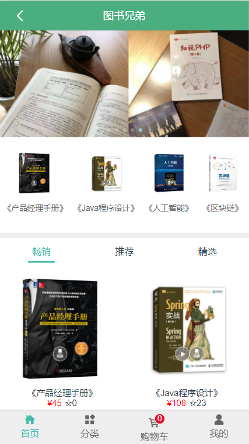

#### 分类

* /category

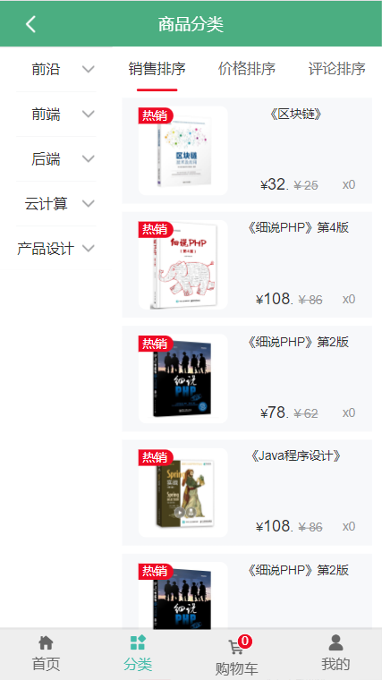

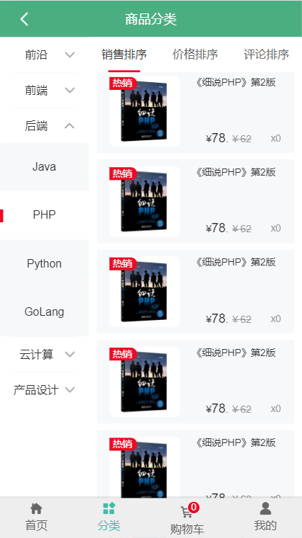

#### 购物车

* /shopcart

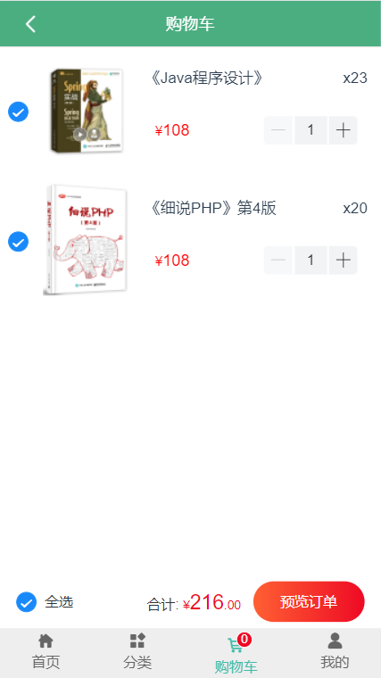

* 购物车为空

#### 个人中心

* /user

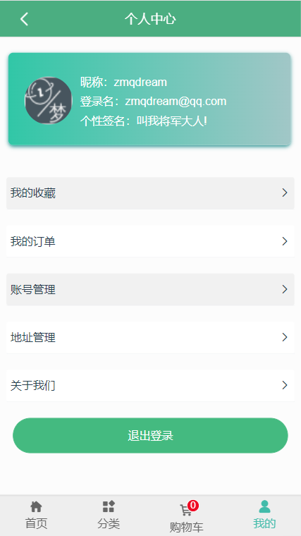

#### 订单管理

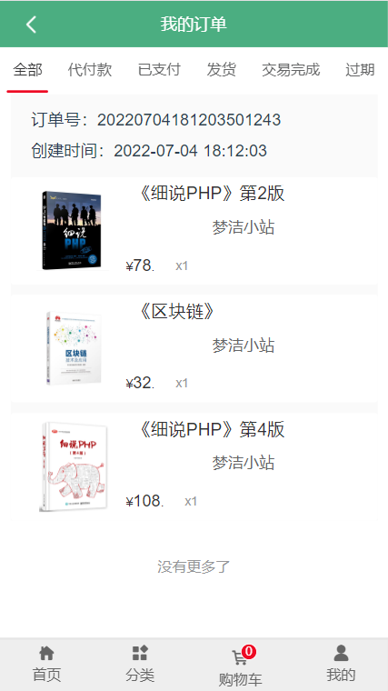

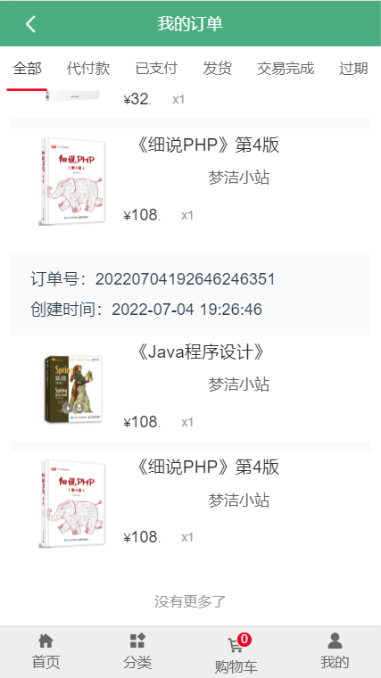

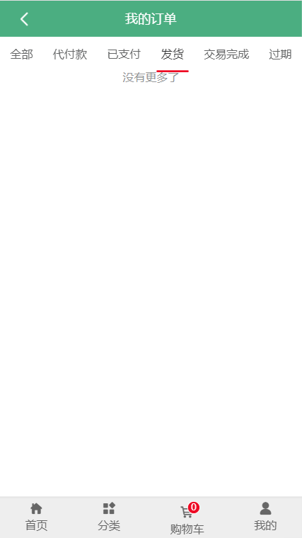

#### 订单详情

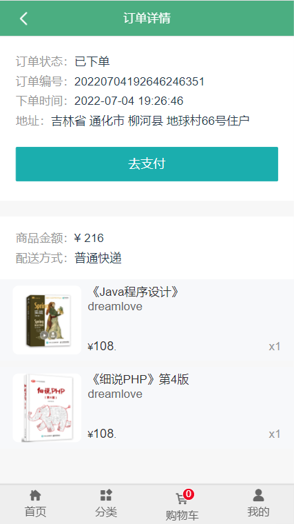

#### 订单支付

* 由于接口原因,只有支付宝,还有就是,如果想弄那个跳转的,弄下也简单

#### 地址管理

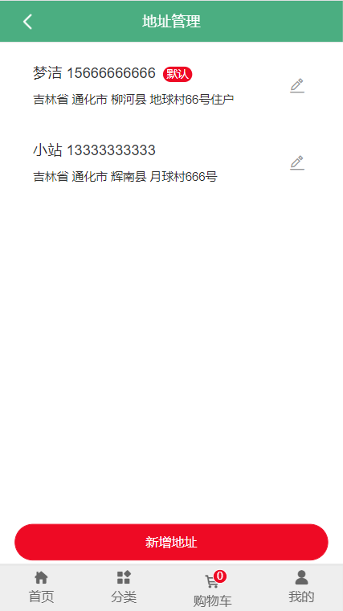

#### 新增地址

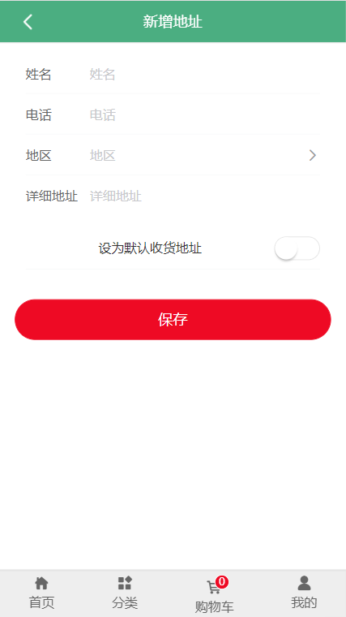

#### 编辑地址

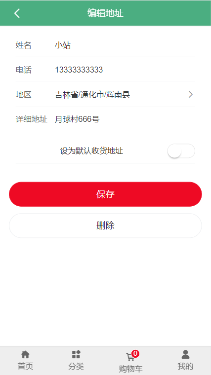

#### 关于我们

